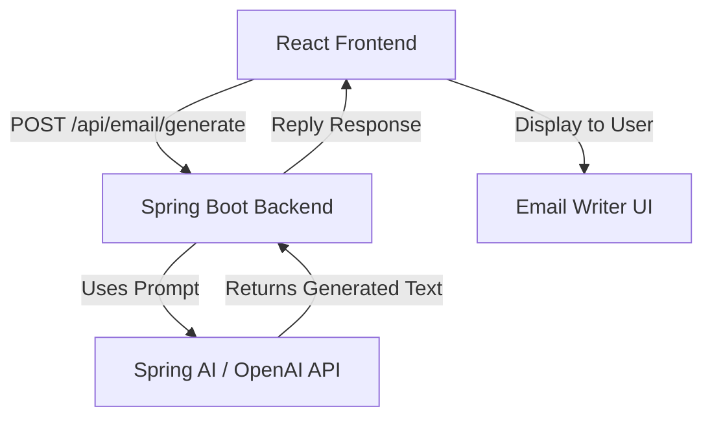

# Email Writer Assistant – React Frontend

The **Email Writer Assistant Frontend** is a modern **React + Vite** web application that allows users to generate AI-powered email replies.  
It connects to a **Spring Boot backend** that uses **Spring AI** or **OpenAI APIs** to generate professional, casual, or friendly email responses — all within seconds.

---

## 🚀 Overview

This frontend acts as the **user interface** for the complete **Email Writer Assistant system**, providing an elegant way to input an email’s content, select a tone, and view or copy the generated AI reply.  

It is designed using **Material UI (MUI)** for responsive components and **Axios** for communicating with the backend API.

---

## 🧩 System Architecture

## 🧠 Features
✅ Simple, elegant UI for composing email prompts
✅ Option to select tone (Professional, Casual, Friendly)
✅ Instant AI-generated reply from backend
✅ Copy-to-clipboard functionality
✅ Error handling and loading states
✅ Built with React (Vite) + Material UI

## ⚙️ Tech Stack
| Layer            | Technology                 |
| ---------------- | -------------------------- |
| Frontend         | React (Vite)               |
| UI Library       | Material UI (MUI)          |
| HTTP Client      | Axios                      |
| State Management | React Hooks                |
| Deployment       | Netlify / Vercel (Planned) |

## 🧩 Components Breakdown
| Component                   | Purpose                               |
| --------------------------- | ------------------------------------- |
| **TextField**               | Input area for original email content |
| **Select (Tone)**           | Choose AI reply tone                  |
| **Button (Generate Reply)** | Sends request to backend              |
| **Typography (Output)**     | Displays AI-generated reply           |
| **Copy Button**             | Copies generated text to clipboard    |
| **Error Section**           | Displays API or connection errors     |

